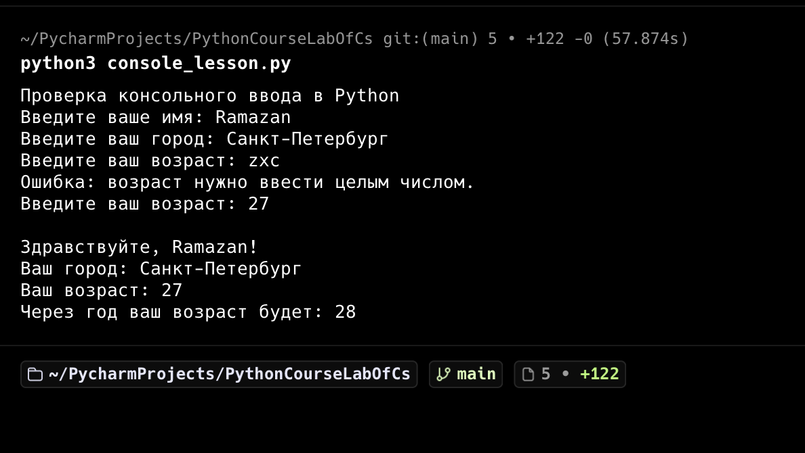

# Запуск программы из командной строки

## Цель

Проверить запуск Python-программы из терминала, ввод данных с клавиатуры и
корректный вывод сообщений на русском языке в кодировке *UTF-8*.

## Файлы

- [Программа с консольным вводом](console_lesson.py)
- [Автоматические тесты](tests/test_console_lesson.py)
- [Официальный сайт Python](https://www.python.org/)

## Запуск

Из каталога проекта программа запускается командой:

```bash
python3 console_lesson.py
```

Программа запрашивает *имя*, *город* и *возраст*. Если вместо возраста введён
текст или отрицательное число, она выводит сообщение об ошибке и повторяет
вопрос.

## Результат

В проверочном запуске сначала специально введено неправильное значение возраста
`не число`, а затем правильное значение `25`.


